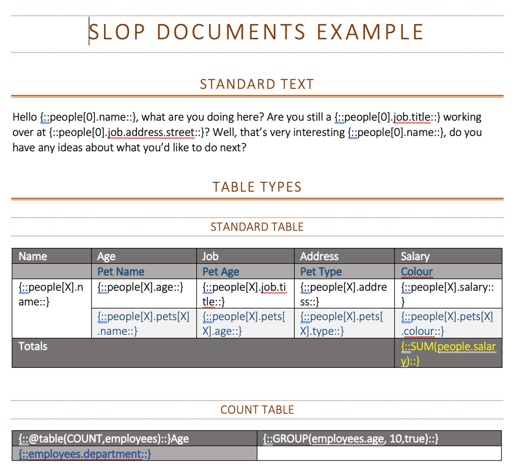

Firstly my apologies for the lack of updates. I've been busy for the last couple of months on a project that uses 
SLOP as its foundation! Originally this was going to be a sample project, but it has now grown into a project in 
its own right. The idea is not a new one and effectively uses value replacement to create documents from a "template"
using source data. I am using Spring Boot to create a service which can be deployed locally or to a cloud
environment. You can then use any language to make a standard POST REST request to an endpoint with a JSON payload.
This would then be interpreted and a document would then be passed back or downloaded via a browser.

The templates can be created using Microsoft Word and are in *.docx format. Once the document has been created, an
option can then be passed to determine what format it is to be downloaded in e.g. DOCX or PDF. Progress is going well
so far and just as a little teaser would like to show off some basic functionality. The following is an example
template which has expressions inter-mingled with standard text. This is not some half-baked implementation of SLOP
either as all language features including statements will be accessible from within the document. There are special
objects which can be generated including tables from the data:



Below is a sample JSON payload. The only requirement is that is uses a "reference" / "object" format, but aside from
that the object can take any form and there is no need to upload scheme's or JAR's onto the classpath:
```json
[
  {
    "reference": "document",
    "object": {
        "title": "Test Document",
        "author": "Test User"
    }
  },
  {
    "reference": "people",
    "object": [
      {
        "name": "Bob",
        "age": 29,
        "address": "14 Dinkly Avenue, New York",
        "salary": 29000,
        "pets": [
          {
            "name": "Fluffy",
            "age": 8,
            "type": "Dog",
            "colour": "Brown"
          },
          {
            "name": "Nibbles",
            "age": 12,
            "type": "Dog",
            "colour": "Gold"
          }
        ],
        "job": {
          "title": "Software Developer",
          "address": {
            "street": "23 Maryland Avenue",
            "town": "Nowhere",
            "county": "Gingurh",
            "country": "Blahdom",
            "postcode": "UJ43 KHD"
          }
        }
      },
      {
        "name": "Sue",
        "age": 38,
        "address": "58 The Avenue, London",
        "salary": 39000,
        "pets": [
          {
            "name": "Bubbles",
            "age": 4,
            "type": "Fish",
            "colour": "Blue / White"
          }
        ],
        "job": {
          "title": "Human Resources",
          "address": {
            "street": "23 Maryland Avenue",
            "town": "Nowhere",
            "county": "Gingurh",
            "country": "Blahdom",
            "postcode": "UJ43 KHD"
          }
        }
      }
    ]
  },
  {
    "reference": "objectB",
    "object": {
      "fieldC": 13,
      "fieldD": true
    }
  },
  {
    "reference": "employees",
    "object": [
        {
            "name": "Bob",
            "department": "HR",
            "age": 35
        },
        {
            "name": "Mary",
            "department": "Development",
            "age": 67
        },
        {
            "name": "Susan",
            "department": "Sales",
            "age": 23
        },
        {
            "name": "Jim",
            "department": "Development",
            "age": 38
        },
        {
            "name": "Richard",
            "department": "HR",
            "age": 35
        },
        {
            "name": "Christine",
            "department": "Sales",
            "age": 28
        }
    ]
  }
]
```
From this the following document gets generated. I have included one of the example table types (Count) which counts
the collection entities matching the two fields based on grouping / exact value matches.

There is still a lot more work to do before this is released, but hopefully this should give you a teaser of what is
to come. As SLOP Docs is being developed much in the same way for expansion as SLOP, I am planning on allowing 
customisation to add features as part of a configuration file and releasing it a separate standalone library for
flexibility.